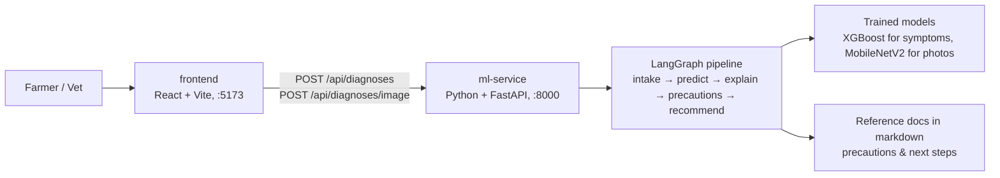

# Cattle Disease Prediction System

A web app that suggests the likely disease of a farm or pet animal from its **symptoms** or
**photos**, explains the result in plain language, and tells the user what to do next —
including when to call a vet immediately.

A farmer or vet picks a species, ticks the symptoms they see (or uploads 1–5 photos), and
gets back a result card: the likely diagnosis, how confident the model is, a short
explanation, precautions, next steps, and a recommended action (`monitor`, `consult_vet`,
or `escalate_to_vet` for reportable diseases such as Foot and Mouth Disease).

> **Not a certified veterinary tool.** This is a learning project. Results are model
> estimates, not a diagnosis. Read [docs/DISCLAIMER.md](docs/DISCLAIMER.md) before relying on
> or extending its predictions.

## Contents

- [What it can diagnose](#what-it-can-diagnose)
- [How it works](#how-it-works)
- [What you need to install](#what-you-need-to-install)
- [Quick start](#quick-start)
- [Configuration (.env files)](#configuration-env-files)
- [Using the app](#using-the-app)
- [API](#api)
- [Project structure](#project-structure)
- [Running the tests](#running-the-tests)
- [Retraining models](#retraining-models)
- [More documentation](#more-documentation)

## What it can diagnose

Five species, each with the models that real data existed for. The trained models are
**included in the repo**, so everything below works straight after installing.

| Species | Symptom diagnosis | Photo diagnosis |
|---|---|---|
| **Cow** | ✅ 5 diseases — Foot and Mouth Disease, Lumpy Skin Disease, Mastitis, Bovine Respiratory Disease, Healthy (88.8% accuracy) | ✅ 4 classes — Healthy, Lumpy Skin Disease, Foot and Mouth Disease, Mastitis (82.5%) |
| **Sheep** | ✅ PPR (Peste des Petits Ruminants) screen only (80.5%) — a negative result means "not PPR", not "healthy" | ⚠️ uses the Cow photo model as a disclosed approximation (no sheep photo dataset exists) |
| **Goat** | ❌ not available (no symptom data exists) | ✅ Healthy / Unhealthy only (80.1%) — can flag a problem but not name it |
| **Cat** | ❌ not available | ✅ Flea Allergy, Healthy, Ringworm, Scabies (83.0%) |
| **Dog** | ❌ not available | ✅ Bacterial Dermatosis, Fungal Infection, Healthy, Hypersensitivity/Allergic Dermatosis (70.5%) |

Every photo is checked twice before any disease model runs: **"is this an animal at all?"**
(a screenshot or a car is refused as `invalid_image`) and **"is it the species you
selected?"** (a dog photo with Cow selected is refused as `species_mismatch`). Both checks
refuse rather than guess. Per-model accuracy details: [ml-service/models/REGISTRY.md](ml-service/models/REGISTRY.md).

## How it works



- **Two services**: a React frontend and a Python `ml-service`. The browser talks to
  `ml-service` directly; there is no other backend.
- **No database.** Nothing is stored; each request is diagnosed and answered.
- **No LLM / AI API.** Explanations are a fixed, plain-language template built from the
  model's own output, and precautions/next steps come from hand-written reference documents
  in [ml-service/data/veterinary-reference/](ml-service/data/veterinary-reference). No API keys
  or paid services are needed.
- **Reportable diseases always escalate**, whatever the confidence — a fixed rule in the
  pipeline, not something a model can change.

More detail: [docs/ARCHITECTURE.md](docs/ARCHITECTURE.md).

## What you need to install

The app needs only **Python** and **Node.js**:

| Software | Version | Used for |
|---|---|---|
| [Python](https://www.python.org/downloads/) | **3.13** | `ml-service` (the API and the models) |
| [Node.js](https://nodejs.org/) | **22.12 or newer** (24 recommended) | `frontend` (the web UI) |
| [Git](https://git-scm.com/) | any | getting the code |

Optional:

| Software | Only needed if you want to… |
|---|---|
| [Docker Desktop](https://www.docker.com/products/docker-desktop/) | run both services with one command instead of two terminals |
| [GNU Make](https://www.gnu.org/software/make/) | use the `make` shortcuts (every target is a one-line `docker compose` command you can run directly — see the [Makefile](Makefile)) |

Worth knowing:

- **All Python packages come from one file**, [ml-service/requirements.txt](ml-service/requirements.txt):
  the API, the models, the dataset download tools and the test runner. Every package
  installs from a prebuilt wheel, so **no C++ compiler** is needed on Windows, macOS or
  Linux. The frontend's packages come from `npm install` as usual.
- **Internet on the first photo diagnosis**: the "is this an animal?" check uses a small
  pretrained model (~14 MB) that PyTorch downloads the first time a photo is diagnosed and
  then caches (`~/.cache/torch`). Symptom diagnosis never needs this.
- **Disk space**: about 1.5 GB for the Python environment (PyTorch is most of it), plus
  ~100 MB for the frontend's `node_modules`.
- **Windows: keep the project path short.** One PyTorch file has a 140-character path inside
  the virtual environment, so if the folder you clone into is deeply nested (e.g. inside
  `OneDrive\Documents\...`), `pip install` can fail with *"No such file or directory … Long
  Path support"*. Clone somewhere short like `C:\Projects\`, or
  [enable Windows long paths](https://pip.pypa.io/warnings/enable-long-paths) once.

## Quick start

Commands are shown for **Windows (PowerShell)**; macOS/Linux equivalents are in the comments.

### 1. Get the code

```powershell
git clone <this-repo-url>
cd <repo-folder>
```

### 2. Start ml-service (terminal 1)

```powershell
cd ml-service
py -3.13 -m venv .venv                          # macOS/Linux: python3.13 -m venv .venv
.venv\Scripts\python -m pip install -r requirements.txt
                                                # macOS/Linux: .venv/bin/python -m pip install -r requirements.txt
Copy-Item .env.example .env                     # macOS/Linux: cp .env.example .env
.venv\Scripts\python -m uvicorn app.main:app --reload
                                                # macOS/Linux: .venv/bin/python -m uvicorn app.main:app --reload
```

It's ready when the log shows `Application startup complete`. Check it at
http://localhost:8000/health — it answers `{"status":"ok"}`.

Calling `.venv\Scripts\python` directly means you never need to "activate" the virtual
environment (activation is often blocked by PowerShell's script policy).

### 3. Start the frontend (terminal 2)

```powershell
cd frontend
npm install
Copy-Item .env.example .env                     # macOS/Linux: cp .env.example .env
npm run dev
```

### 4. Open the app

Go to **http://localhost:5173**. That's it — the trained models ship with the repo, so
there's nothing to train.

### Alternative: Docker (both services, one command)

```powershell
Copy-Item ml-service\.env.example ml-service\.env   # macOS/Linux: cp ml-service/.env.example ml-service/.env
Copy-Item frontend\.env.example frontend\.env       # macOS/Linux: cp frontend/.env.example frontend/.env
docker compose up --build                            # or: make up
```

Then open http://localhost:5173. Stop with `Ctrl+C`, or `docker compose down` (`make down`).
Both `.env` files must exist — Docker Compose refuses to start without them. The first build
downloads PyTorch, so expect a few minutes and an image of about 3–4 GB.

## Configuration (.env files)

Each folder that reads settings has a `.env.example` listing every setting it uses, with a
working default. Copy it to `.env` in the same folder (`.env` files are git-ignored — never
commit one).

| File | Setting | Default | What it does |
|---|---|---|---|
| [ml-service/.env.example](ml-service/.env.example) | `CORS_ALLOWED_ORIGINS` | `http://localhost:5173` | Which browser origins may call the API. Comma-separated. Add your frontend's URL when you host it somewhere. |
| | `ROBOFLOW_API_KEY` | *(empty)* | Only for re-downloading the Cow Mastitis training photos. Free key from [roboflow.com](https://roboflow.com). |
| | `PORT` | `8000` | Port for the Docker image's start command (hosting platforms set it for you). |
| [frontend/.env.example](frontend/.env.example) | `VITE_API_BASE_URL` | `http://localhost:8000` | Where the UI sends API requests (the `ml-service` URL). Restart `npm run dev` after changing it. |
| [tests/e2e/.env.example](tests/e2e/.env.example) | `FRONTEND_URL`, `ML_SERVICE_URL` | the local ports | Only if the end-to-end tests should target a stack on other ports. |

No setting is secret except `ROBOFLOW_API_KEY`, and the app runs without it.

## Using the app

### Symptom diagnosis

Pick a species (Cow or Sheep), tick symptoms, press **Get diagnosis**. Combinations that
reliably give a confident result:

| Species | Tick | Result |
|---|---|---|
| Cow | Fever + Mouth lesions + Excessive salivation + Lameness | **Foot and Mouth Disease** — escalate to vet |
| Cow | Fever + Skin nodules + Drop in milk yield | **Lumpy Skin Disease** — escalate to vet |
| Cow | Fever + Udder swelling + Drop in milk yield | **Mastitis** — consult vet |
| Cow | Fever + Nasal discharge + Coughing + Labored breathing | **Bovine Respiratory Disease** — consult vet |
| Cow | nothing | **Healthy** — monitor |
| Sheep | Nasal discharge + Sores in mouth or nose | **PPR** — escalate to vet |
| Sheep | nothing | **PPR Negative** |

### Photo diagnosis

Upload 1–5 JPEG or PNG photos (up to 5 MB each). Each photo is diagnosed separately; if
they don't all agree, the result shows a **"diagnoses disagree"** warning so the user looks
more closely. Sample photos to try: the training datasets, if you've downloaded them (see
[Retraining models](#retraining-models)), or any photo of the animal's affected area.

Try the safety checks too: upload a screenshot (→ "not a valid photo"), or a dog photo with
Cow selected (→ "wrong species").

## API

`ml-service` serves the frontend's API. Interactive docs: http://localhost:8000/docs.
Full contract: [docs/API_CONTRACTS.md](docs/API_CONTRACTS.md).

```bash
# Symptom diagnosis → 201 with the result
curl -X POST http://localhost:8000/api/diagnoses \
  -H "Content-Type: application/json" \
  -d '{"species": "COW", "symptoms": {"fever": true, "mouth_lesions": true, "excessive_salivation": true, "lameness": true}}'

# Photo diagnosis (1-5 photos) → 201 with {"results": [...], "diagnosesAgree": true|false}
curl -X POST http://localhost:8000/api/diagnoses/image \
  -F "species=COW" -F "images=@photo1.jpg" -F "images=@photo2.jpg"
```

Response for a symptom diagnosis:

```json
{
  "species": "COW",
  "diagnosis": "Foot and Mouth Disease",
  "confidence": 0.9951,
  "explanation": "Foot and Mouth Disease is the closest match — the strongest signs were mouth lesions, excessive salivation and lameness.",
  "recommendedAction": "escalate_to_vet",
  "precautions": ["Isolate the affected animal from the rest of the herd immediately.", "..."],
  "nextSteps": ["Contact your veterinarian or local animal health authority immediately — ...", "..."],
  "createdAt": "2026-09-27T10:15:30.123456Z"
}
```

Errors always have the same shape — `{"code": "...", "message": "...", "details": ...}`:

| Situation | Status and code |
|---|---|
| `species` or `symptoms` missing | `400 VALIDATION_FAILED` |
| Unknown species, or a malformed body | `400 INVALID_REQUEST_BODY` |
| Symptom diagnosis for Cat, Dog or Goat | `400 DIAGNOSIS_NOT_SUPPORTED_FOR_SPECIES` |
| No photo, empty photo, or not a multipart upload | `400 IMAGE_REQUIRED` |
| More than 5 photos | `400 TOO_MANY_IMAGES` |
| Not JPEG/PNG | `400 UNSUPPORTED_IMAGE_TYPE` |
| A photo over 5 MB | `400 IMAGE_TOO_LARGE` |
| A model file is missing | `503 MODEL_NOT_TRAINED` |

Every response carries an `X-Correlation-Id` header (sent by the frontend, or generated),
which also appears in `ml-service`'s log line for that request.

## Project structure

| Path | What's there |
|---|---|
| [frontend/](frontend) | React 19 + Vite web UI — symptom form, photo upload, result card |
| [ml-service/](ml-service) | Python FastAPI service — the public API (`app/api/`), the LangGraph pipeline (`app/agent/`), model wrappers (`app/models/`) |
| [ml-service/models/](ml-service/models) | The trained model files, and [REGISTRY.md](ml-service/models/REGISTRY.md) with each one's accuracy |
| [ml-service/training/](ml-service/training) | Scripts that download data and (re)train each model |
| [ml-service/data/](ml-service/data) | Reference documents (precautions/next steps) and, once downloaded, the training datasets — each folder's `SOURCE.md` says where its data comes from |
| [tests/e2e/](tests/e2e) | Playwright end-to-end tests against the running app |
| [docs/](docs) | Architecture, API contract, decisions log, specs, roadmap |
| [agents/playbooks/](agents/playbooks), [.claude/skills/](.claude/skills) | How-to guides for contributors and AI coding agents |

Agent-context files: [AGENTS.md](AGENTS.md) (conventions), [STATE.md](STATE.md) (current
progress), [HANDOFF.md](HANDOFF.md) (latest session notes).

## Running the tests

| Suite | Command | Notes |
|---|---|---|
| ml-service (pytest, 135 tests) | `cd ml-service` then `.venv\Scripts\python -m pytest` | Runs natively. Tests that need the training photos skip themselves until you download the datasets (`python -m training.fetch_datasets`). |
| frontend (Vitest, 29 tests) | `cd frontend` then `npm test` | `npm run lint` and `npm run build` are also checked in CI. |
| end-to-end (Playwright) | start the app, then `cd tests/e2e`, `npm install`, `npx playwright install chromium` (once), `npx playwright test` | Checks both services respond and the UI loads. |

CI ([.github/workflows/ci.yml](.github/workflows/ci.yml)) runs the frontend and ml-service
suites on every pull request. More: [docs/TESTING.md](docs/TESTING.md).

## Retraining models

Not needed to run the app — only if you want to rebuild a model from its data.

The training datasets are **not** in the repo (about 800 MB of photos). Git only carries the
small files in `ml-service/data/`: the reference documents the app uses, and a `SOURCE.md`
per dataset naming its source and license. You download the datasets yourself, with one
command:

1. **Download the datasets**, from `ml-service/`:

   ```powershell
   .venv\Scripts\python -m training.fetch_datasets     # macOS/Linux: .venv/bin/python -m training.fetch_datasets
   ```

   This downloads the Cow, Cat, Dog and Goat photos and the Sheep symptom data from Kaggle
   (no account needed, about 800 MB) and puts each class in the folder the training scripts
   expect. Folders that already have files are skipped, so it's safe to re-run; downloads
   are cached in `~/.cache/kagglehub`.

   **Cow Mastitis photos are separate**: they need a free Roboflow key
   (`ROBOFLOW_API_KEY` in `ml-service/.env`), then
   `.venv\Scripts\python -m training.fetch_mastitis_data`. Read
   [cattle-images/SOURCE.md](ml-service/data/cattle-images/SOURCE.md) first — the photos in
   use were hand-reviewed after download, and a fresh download includes mislabelled images.
2. **Train**, from `ml-service/`:

| Model | Command | Data needed |
|---|---|---|
| Cow symptoms | `.venv\Scripts\python -m training.generate_synthetic_data` then `-m training.symptom_model_train` | none — generates its own synthetic data |
| Sheep symptoms (PPR) | `.venv\Scripts\python -m training.sheep_symptom_model_train` | `data/sheep-symptoms/` |
| Cow photos | `.venv\Scripts\python -m training.image_model_train` | `data/cattle-images/`, **including** `mastitis/` — without it the retrained model loses Mastitis |
| Cat photos | `.venv\Scripts\python -m training.cat_image_model_train` | `data/cat-images/` |
| Dog photos | `.venv\Scripts\python -m training.dog_image_model_train` | `data/dog-images/` |
| Goat photos | `.venv\Scripts\python -m training.goat_image_model_train` | `data/goat-images/` |
| Species check | `.venv\Scripts\python -m training.species_classifier_train` | all four photo datasets — train it last |

Each run overwrites the model file in `ml-service/models/` and appends its accuracy to
`models/REGISTRY.md`. To undo a local retrain: `git checkout -- ml-service/models`.

## More documentation

- [docs/ARCHITECTURE.md](docs/ARCHITECTURE.md) — how the pieces fit together
- [docs/API_CONTRACTS.md](docs/API_CONTRACTS.md) — every endpoint, field and error code
- [docs/DECISIONS.md](docs/DECISIONS.md) — why things are the way they are
- [docs/DISCLAIMER.md](docs/DISCLAIMER.md) — safety limits of the predictions
- [docs/ROADMAP.md](docs/ROADMAP.md) — what's done and what's next
- [CONTRIBUTING.md](CONTRIBUTING.md) — branches, commits, issues and pull requests
