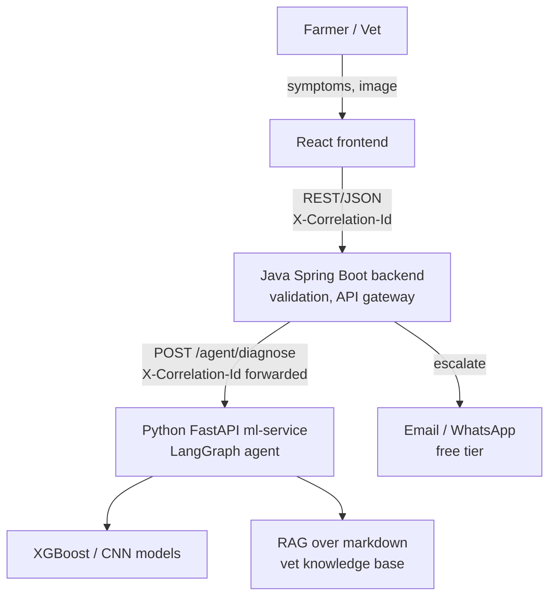
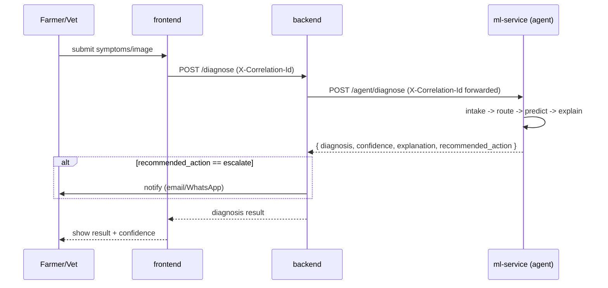

# Architecture

## Diagnosis request flow

## Why this split

- **Java (backend)**: request validation, species rules, and the API gateway to
  `ml-service` — plays to existing team skill, and the mature ecosystem is there if
  auth/persistence are ever needed (Spring Security, Spring Data, Flyway). **There is no
  database today**: both were removed once neither was earning its place — see
  [specs/remove-databases.md](specs/remove-databases.md). The backend is stateless.
- **Python (ml-service)**: ML training/inference and agent orchestration (LangGraph) are
  Python-native ecosystems — fighting that would cost more than it saves.
- **React (frontend)**: symptom/image intake UI, results display.

The two backend services communicate over plain REST — no shared runtime, no shared
language-specific dependency, just an HTTP boundary with a documented contract (see
[API_CONTRACTS.md](API_CONTRACTS.md)).

## Request tracing

Every request gets an `X-Correlation-Id` at the frontend edge (or generated by backend if
missing), forwarded on every downstream call, and logged by all three services. This is the
only way to reconstruct one user's request across three independently-logging services —
non-negotiable from day one, expensive to retrofit later.
