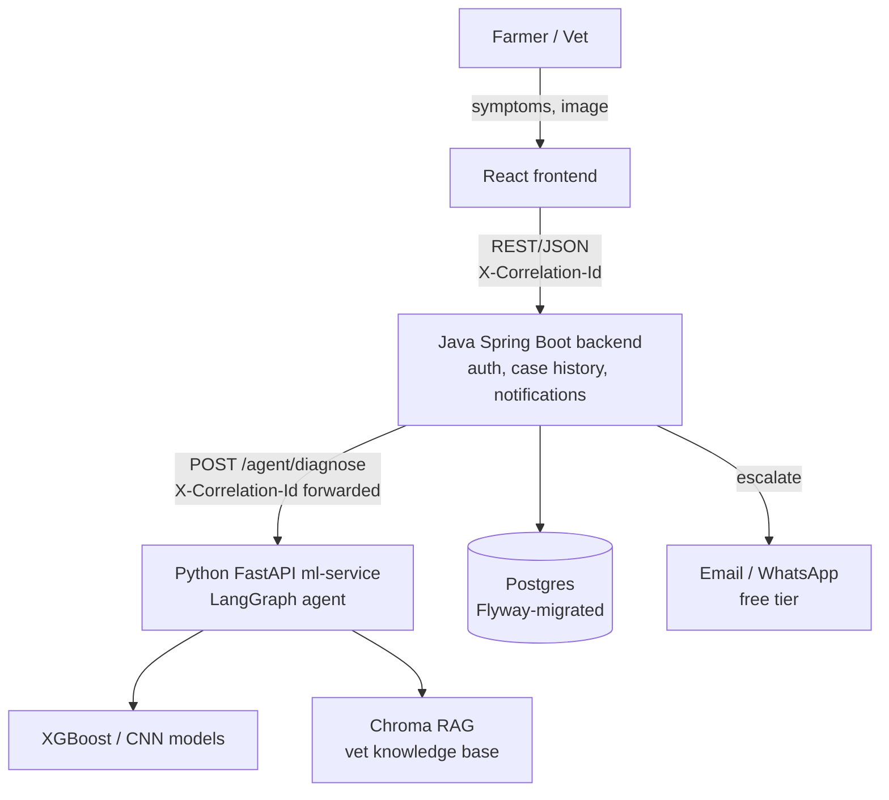
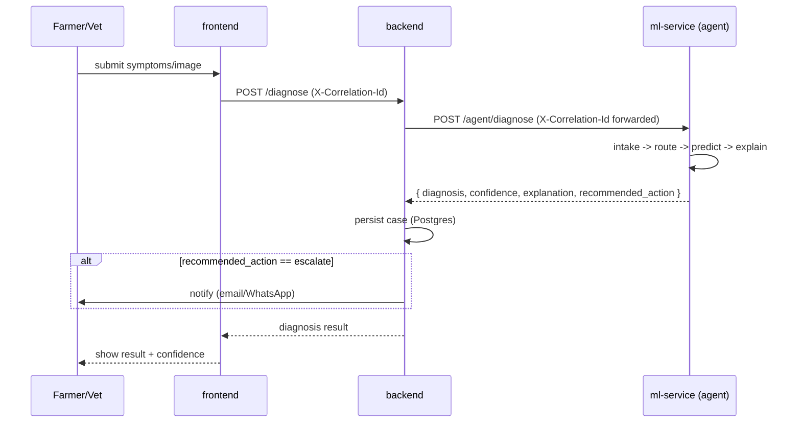

# Architecture

## Diagnosis request flow

## Why this split

- **Java (backend)**: everything that's conventional CRUD/business-logic/auth — plays to
  existing team skill, mature ecosystem for this kind of work (Spring Security, Spring Data,
  Flyway).
- **Python (ml-service)**: ML training/inference and agent orchestration (LangGraph) are
  Python-native ecosystems — fighting that would cost more than it saves.
- **React (frontend)**: symptom/image intake UI, results display.

The two backend services communicate over plain REST — no shared runtime, no shared
language-specific dependency, just an HTTP boundary with a documented contract (see
[API_CONTRACTS.md](API_CONTRACTS.md)).

## Request tracing

Every request gets an `X-Correlation-Id` at the frontend edge (or generated by backend if
missing), forwarded on every downstream call, and logged by all three services. This is the
only way to reconstruct one user's request across three independently-logging services —
non-negotiable from day one, expensive to retrofit later.
