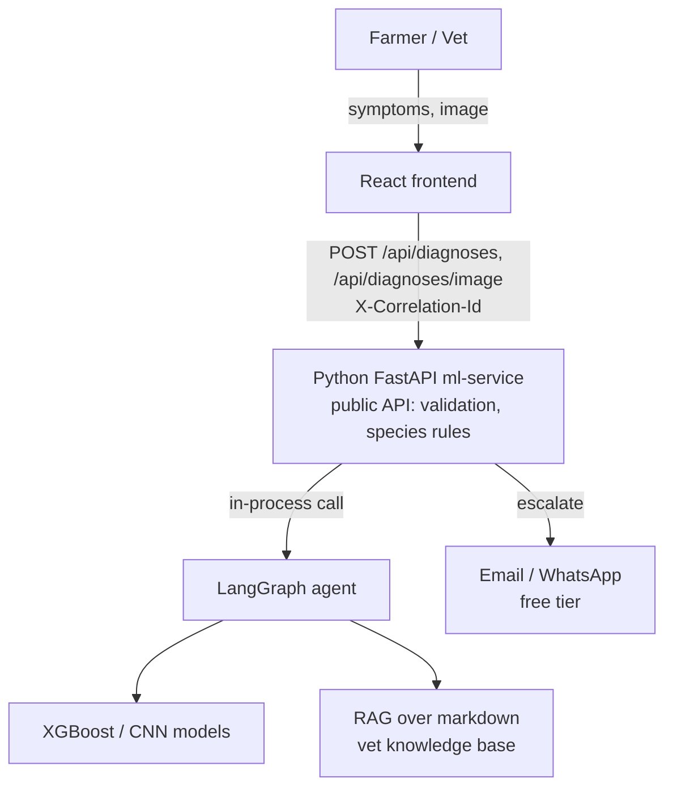
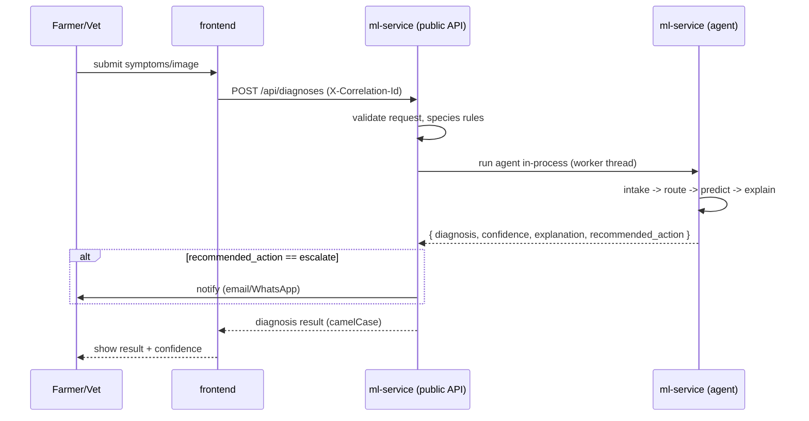

# Architecture

```mermaid
flowchart TD
    U[Farmer / Vet] -->|symptoms, image| FE[React frontend]
    FE -->|POST /api/diagnoses, /api/diagnoses/image<br/>X-Correlation-Id| API[Python FastAPI ml-service<br/>public API: validation, species rules]
    API -->|in-process call| ML[LangGraph agent]
    ML --> MODELS[XGBoost / CNN models]
    ML --> RAG[RAG over markdown<br/>vet knowledge base]
    API -->|escalate| NOTIFY[Email / WhatsApp<br/>free tier]
```

## Diagnosis request flow

```mermaid
sequenceDiagram
    participant U as Farmer/Vet
    participant FE as frontend
    participant API as ml-service (public API)
    participant ML as ml-service (agent)

    U->>FE: submit symptoms/image
    FE->>API: POST /api/diagnoses (X-Correlation-Id)
    API->>API: validate request, species rules
    API->>ML: run agent in-process (worker thread)
    ML->>ML: intake -> route -> predict -> explain
    ML-->>API: { diagnosis, confidence, explanation, recommended_action }
    alt recommended_action == escalate
        API->>U: notify (email/WhatsApp)
    end
    API-->>FE: diagnosis result (camelCase)
    FE-->>U: show result + confidence
```

## Why this split

- **Python (ml-service)**: the public API the frontend calls (request validation, species
  rules, response shaping — `app/api/diagnoses.py`), plus ML training/inference and agent
  orchestration (LangGraph), which are Python-native ecosystems — fighting that would cost
  more than it saves. **There is no database**: both were removed once neither was earning
  its place — see [specs/remove-databases.md](specs/remove-databases.md). The service is
  stateless.
- **React (frontend)**: symptom/image intake UI, results display.

There used to be a third service — a stateless Java/Spring Boot gateway between the two —
merged into `ml-service` so there's one server language and no service-to-service hop; see
[specs/merge-backend-into-ml-service.md](specs/merge-backend-into-ml-service.md) and
[DECISIONS.md](DECISIONS.md). The frontend and `ml-service` communicate over plain REST — just
an HTTP boundary with a documented contract (see [API_CONTRACTS.md](API_CONTRACTS.md)).

## Request tracing

Every request gets an `X-Correlation-Id` at the frontend edge (or generated by `ml-service`
if missing), echoed on the response, and logged by both services. This is the only way to
reconstruct one user's request across independently-logging services — non-negotiable from
day one, expensive to retrofit later.
